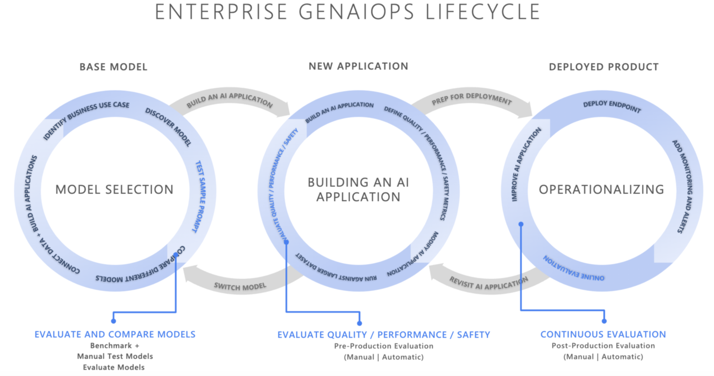
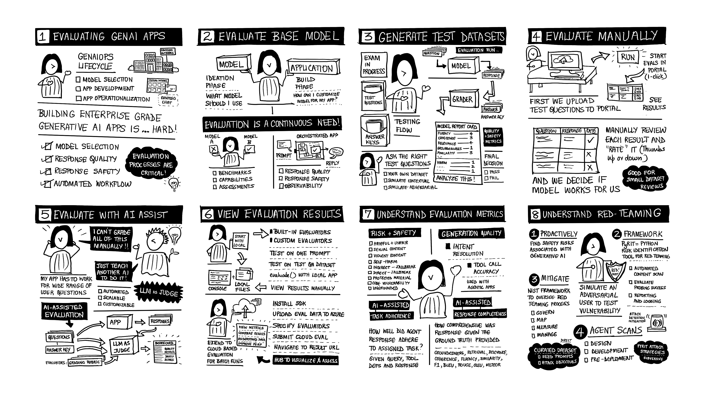

# 2. Lab Presentation

!!! quote "BY THE END OF THIS SECTION YOU SHOULD BE ABLE TO"

    - Explain the role of evaluations in the GenAIOps lifecycle
    - Understand the key tools and capabilities of the Azure AI Evaluations SDK
    - Understand how to apply these learnings to a relevant application scenario

=== "I AM A SESSION ATTENDEE"

    !!! info "Your instructor already covered this content - You can now **[GET STARTED ON LAB 1](./../02-Labs/01.md)**"

=== "I AM A SELF-GUIDED LEARNER"

    !!! info "This section gives you some background for the labs. Review it to learn core concepts & objectives.**"

    ---

    ## 1. The GenAIOps Lifecycle

    **Generative AI Operations** (GenAIOps), refers to the practice of managing, evaluating, and improving generative AI systems to ensure they produce trustworthy, reliable, and safe outputs throughout their lifecycle. The GenAIOps cycle can be viewed as 3 stages:

    1. **Model Selection** - the first step is to _find the right model for your needs_
    1. **App Development** - the next step is to _customize_ model behavior to suit requirements
    1. **Operationalization** - the last step is to _monitor and optimize_ apps in production

    

    **Evaluations** are critical to this process, helping us gain user confidence and trust in the quality and safety of our applications at each step:

    1. **Model Selection** - use a relevant dataset to evaluate models for fit
    1. **App Development** - use built-in and custom evaluators to assess quality and safety
    1. **Operationalization** - use tools to analyze results and optimize apps continuously

    ---

    ## 2. The Application Scenario

    Understanding complex concepts is easier if we have an application scenario that we can use to _contextualize_ the discussion. Let's revisit this popular application scenario. **Contoso Outdoors** is a fictional enterprise retailer that sells outdoor hiking and camping equipment on their website. The figure shows a mockup of that experience.

    

    The popularity of the site has created a bottleneck for customer support. So they have asked you to build [**Contoso Chat**](https://aka.ms/aitour/contoso-chat) - a RAG-based retail copilot that can answer questions grounded in the product catalog and customer purchase history.

    

    !!! info "NOTE: This workshop does NOT build Contoso Chat."

        We are using the application scenario to frame the discussion on evaluation in a real-world context. However, each lab will use a toy dataset or app to teach the tools, metrics, and processes **for evaluation**. If you are interested in learning to build Contoso Chat as an application, check out our previous [AI Tour Workshops](https://aka.ms/aitour/contoso-chat/workshop) for details.

    You are a new hire in that team - and you are tasked with the following:

    1. **Model Selection** - find us the right model to use for the job
    1. **Evaluation Dataset** - get us the right dataset to use for evaluations
    1. **Evaluation Metrics** - identify evaluators we should use for quality & safety
    1. **Custom Evaluators** - identify gaps in evaluation metrics that we should fill

    _What do you do?_ Let's take you on the developer journey for evaluation.

    ---

    ## 3. The Developer Journey

    The storyboard below visualizes the typical developer journey into evaluations. 

    

    Let's get a brief sense of what these steps involve:

    1. **GenAIOps** - end-to-end development of Generative AI apps starts with model selection.
    1. **Model Selection** - use evaluations to compare base models - and pick one for development.
    1. **Dataset Generation** - use simulators to create synthetic datasets - from different options.
    1. **Evaluate Manually** - try out the model with test prompts in the portal - before coding.
    1. **Evaluate with SDK** - use built-in and custom evaluators - with AI-assisted workflows.
    1. **Customize It** - build and run custom evaluators - address gaps in built-in metrics.
    1. **Operationize It** - use tools to analyze results and optimize apps continuously.

    !!! info "In this lab, we will cover some of these elements in our main **Workshop** track - and provide bonus labs ("Homework") with learning resources to help you explore the rest at your own pace."

    ---

    ## References

    Three core resources to bookmark and revisit for this workshop:

    - [Azure AI Documentation](https://learn.microsoft.com/en-us/azure/ai-services/)
    - [Azure Best Practices for AI](https://learn.microsoft.com/en-us/azure/architecture/example-scenario/ai/)
    - [Azure AI Evaluation Tools](https://learn.microsoft.com/en-us/azure/machine-learning/how-to-evaluate-models)

