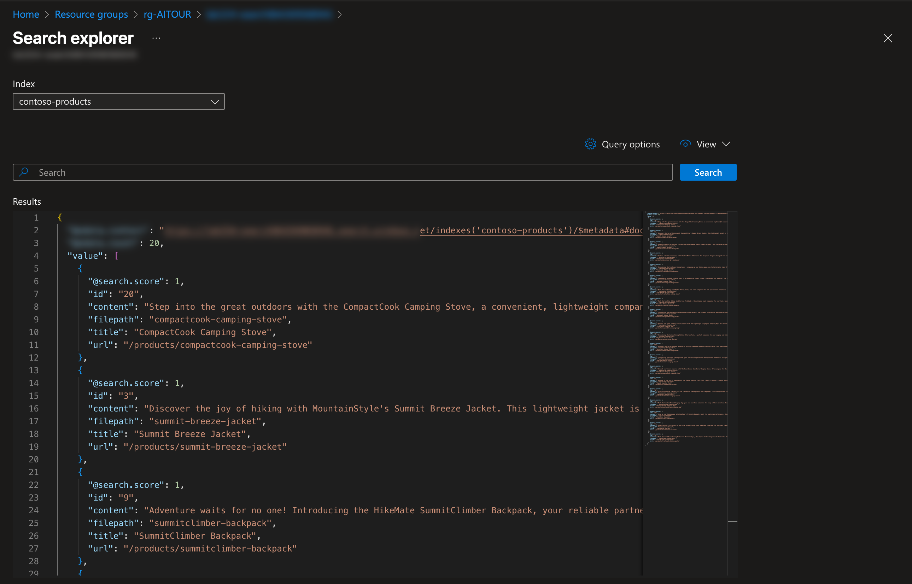
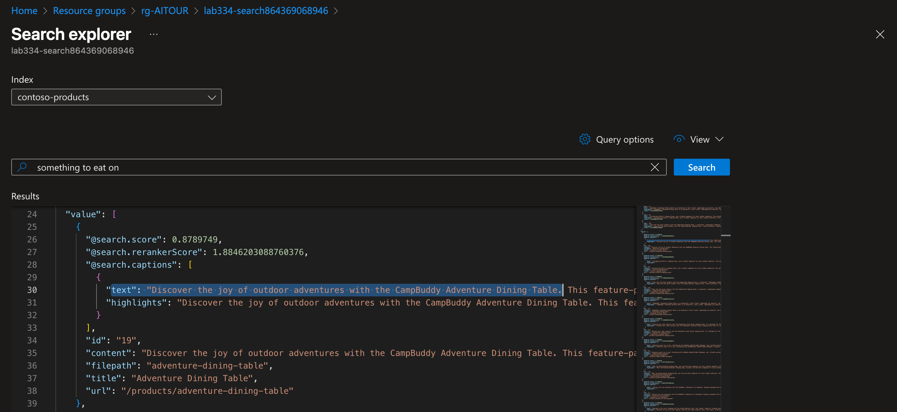

# Lab 0: Simulate Datasets

!!! quote "In this lab, you will learn to generate a synthedic dataset using the Simulator."

    By the end of this lab, you should be should know:

    - [X] What the Simulator is and how to use it
    - [X] How to generate a synthetic dataset from a search index
    - [X] How to run an evaluation on the synthetic dataset

---

## Motivation

When building a generative AI prototype, we can use a _sample query_ to test and iterate on the prototype. But before we deploy this to production, we need to test it with a large and diverse set of queries to verify that its responses will always meet our desired quality and safety criteria.

But where do we get this test dataset from? 

There are typically three options:

1. **Bring Your Own Data** - e.g., customer support conversation records from a call center
1. **Create Test Dataset** - e.g., manually create a small dataset to get started
1. **Create Synthetic Dataset** - e.g., use tools to simulate relevant datasets for scale

!!! quote "In this lab we explore option 3 - using the Simulator feature to generate synthetic data from a search index"

---

## Contoso Products

In this lab, we'll create an index called `contoso-products` using the data found in `data/product_info/products.csv`. Once created, we can then use it with the Simulator to generate a sample set of _question-answer_ pairs based on our search index.

??? info "Example Product: *CampBuddy Adventure Dining Table* (click to expand)"

    | Attribute     | Value |
    |:---           |:---|
    | id            | 19 |
    | name          | Adventure Dining Table |
    | price         | 90.0 |
    | category      | Camping Tables |
    | brand         | CampBuddy | 
    | description   | Discover the joy of outdoor adventures with the CampBuddy Adventure Dining Table. This feature-packed camping essential brings both comfort and convenience to your memorable trips. Made from high-quality aluminum, it promises long-lasting performance, weather resistance, and easy maintenance - all key for the great outdoors! It's light, portable, and comes with adjustable height settings to suit various seating arrangements and the spacious surface comfortably accommodates meals, drinks, and other essentials. The sturdy yet lightweight frame holds food, dishes, and utensils with ease. When it's time to pack up, it fold and stows away with no fuss, ready for the next adventure!  Perfect for camping, picnics, barbecues, and beach outings - its versatility shines as brightly as the summer sun! Durable, sturdy and a breeze to set up, the Adventure Dining Table will be a loyal companion on every trip. Embark on your next adventure and make lifetime memories with CampBuddy. As with all good experiences, it'll leave you wanting more!|


---

## 1. Populate the Search Index

First, we need to create the search index and populate it with our data. For convenience, we have provided a dataset and a notebook that will do this for you. Just follow these two steps:

### 1.1. Update Access Roles

We need our user identity to have specific access roles to the search resource - this step should take just a few seconds.

1. Return to the GitHub Codespaces environment (browser tab)
1. Run this command in the VS Code terminal - it completes within a minute or so.

    ```bash title="" linenums="0"
    ./scripts/update-search-roles.sh
    ```

### 1.2 Upload The Data

We have a `data/product_info/products.csv` file with product data. In this step, we just run the notebook that uploads the data and creates a search index called `contoso-products`. This step should take just a minute or so to complete.

1. Open the `data/product_info/create-azure-search.ipynb` notebook in editor.
    - Select Kernel - use the default Python environment (see: `3.12.10`)
    - Click "Clear Outputs", then "Run All" - this takes 1-2 minutes to complete
    - ✅ | You should see: _"uploading 20 documents to index contoso-products"_

### 1.3 Validate Index Creation

1. **Verify the product search index was created**
    - Return to Azure Portal browser tab - it should be open to the Search service page:
        
    - Click on **Search explorer** - you see `contoso-products` as shown. Click "Search" to see default search results for an empty query. It should look like this:
        

1. **Test the Index**
    - Copy this query into the search box and click **Search**:

        ```bash title="" linenums="0"
        Something to eat on
        ```
    
    - Look at the `value` field - you see something like this. You got a semantically meaningful result that goes beyond keyword matching. _This is an example of vector search_.

        


---

## 2. Use Simulator with Index

!!! info "All labs are setup as Jupyter notebooks - just follow these instructions:"

1. Open the `labs/00-simulate-datasets.ipynb` notebook in the VS Code editor.
1. Click **Select Kernel** in the top right corner of the notebook - pick default Python kernel.
1. Click **Clear All Outputs** in the top menu bar of the notebook - clears output from prior runs.
1. Click **Run All Cells** in the top menu bar of the notebook - let the run complete.

Now, review the notebook cell-by-cell to understand the steps. Answer questions or try alternative options when prompted, to build your understanding of the code.

---
