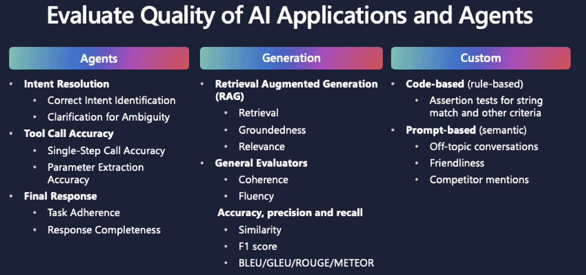

# Lab 2: Quality Evaluation

!!! quote "In this lab, you will learn about quality evaluations in Azure AI Foundry."

    By the end of this lab, you will know:

    - [X] What AI-Assisted evaluation workflows are, and how to run them.
    - [X] How to use built-in quality evaluators in Azure AI Foundry
    - [X] How to run a quality evaluator with a test prompt (to understand usage)
    - [X] How to run a composite quality evaluator (with multiple evaluators)

---

## AI-Assisted Quality Evaluation

The built-in evaluators in Azure AI Foundry use an **AI-Assisted evaluation workflow**.

1. First, we identify a "test dataset" - with typical user prompts for the target app
1. Next, we feed these to the application (chat model) - and collect responses
1. Next, we feed responses (with inputs & ground truth) to the evaluator (judge model)
1. The evaluator grades the response and returns results (metrics) for various criteria.

---

## Built-in Quality Evaluators

The Azure AI Foundry platform provides a set of built-in quality evaluators as shown below. In this lab, we'll focus on exploring **Generation** and **Custom** evaluators - with a single example in each case.  You can then use the notebook as a sandbox to explore other evaluators on your own.

!!! quote "Interested in Agents evaluation? Star this repo and revisit it for more lab notebooks post-Build!"

## Instructions

!!! info "All labs are setup as Jupyter notebooks - just follow these instructions:"

1. Open the `labs/02-quality-evaluators.ipynb` notebook in the VS Code editor.
1. Click **Select Kernel** in the top right corner of the notebook - pick default Python kernel.
1. Click **Clear All Outputs** in the top menu bar of the notebook - clears output from prior runs.
1. Click **Run All Cells** in the top menu bar of the notebook - let the run complete.

Now, review the notebook cell-by-cell to understand the steps. Answer questions or try alternative options when prompted, to build your understanding of the code.

---
