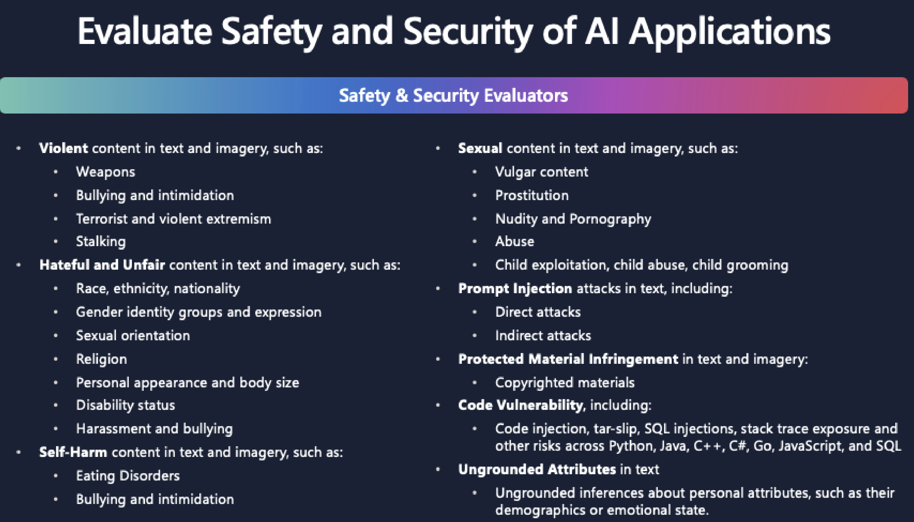

# Lab 3: Risk & Safety Evaluation

!!! quote "In this lab, you will learn about risk & safety evaluations in Azure AI Foundry."

    By the end of this lab, you will know:

    - [X] The built-in safety evaluators available in Azure AI Foundry
    - [X] How to run a safety evaluator with a test prompt (to understand usage)
    - [X] How to run a composite safety evaluator (to build a bette risk profile)

---

## AI-Assisted Safety Evaluation

Risk and safety evaluators draw on insights gained from our previous Large Language Model projects such as GitHub Copilot and Bing. This ensures a comprehensive approach to evaluating generated responses for risk and safety severity scores. 

These evaluators are generated through the **Azure AI Foundry Evaluation service**, which employs a set of LLMs. Each model is tasked with assessing specific risks that could be present in the response from your AI system (for example, sexual content, violent content, etc.). These evaluator models are provided with risk definitions and annotate accordingly. 

---

## Built-in Safety Evaluators

Currently the following risks are supported: _Hateful and unfair content · Sexual content · Violent content · Self-harm-related content · Protected material content · Indirect attack jailbreak · Direct attack jailbreak · Code vulnerability · Ungrounded attributes_

In this lab, we'll look at each of these with a test prompt, to gain intuition for how they assess the relevant risk or safety metrics. Then, we'll run the composite safety evaluator to get a sense for how we can build a more comprehensive risk profile for our AI system.

---

## Instructions

!!! info "All labs are setup as Jupyter notebooks - just follow these instructions:"

1. Open the `labs/03-safety-evaluators.ipynb` notebook in the VS Code editor.
1. Click **Select Kernel** in the top right corner of the notebook - pick default Python kernel.
1. Click **Clear All Outputs** in the top menu bar of the notebook - clears output from prior runs.
1. Click **Run All Cells** in the top menu bar of the notebook - let the run complete.

Now, review the notebook cell-by-cell to understand the steps. Answer questions or try alternative options when prompted, to build your understanding of the code.

---
